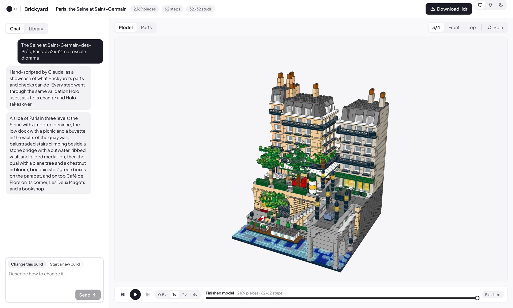

<h1 align="center">
  
  Brickyard
</h1>

<p align="center">Watch Holo build LEGO models step by step.</p>



- **Chat** to describe a model; Holo, a sagent agent, writes a Python build script, and every run rebuilds the model, streams the new steps and shows Holo the render.
- **Candidates are checked before publication**: a script with rejected parts or unsupported groups preserves the
  previous model. Checks use bounding boxes; they do not certify LEGO connections or physical stability.
- **Replay** the steps, browse the parts list, download the `.ldr`.
- **Shop bricks**: copy a ready-made request into HoloTab, which can import the saved parts list on BrickLink and prepare carts for you to review and pay. Includes a HoloTab install link; no extension integration or API key is required.
- **Catalog-checked inventory**: construction and shopping verify every part/color pair against BrickLink's
  Known colors. Unverified combinations are rejected with repair choices; only complete verified inventories
  produce canonical BrickLink XML. See [SHOPPING.md](SHOPPING.md) for freshness and availability limits.
- **Share** an assembly GIF from the timeline or download menu, with optional HOLO4 / H Company branding for Holo builds.

Gallery for the H team: [brickyard-h-company.vercel.app](https://brickyard-h-company.vercel.app) (Vercel login).

## Run

```bash
scripts/fetch-ldraw.sh                        # LDraw parts library into ./ldraw (145 MB)
cd server && uv sync && cd ..
cd web && npm install && npm run build && cd ..
server/.venv/bin/brickyard                    # http://127.0.0.1:8000
```

Hot reload: `cd web && npm run dev` (http://127.0.0.1:5173).

| Variable | Default |
| --- | --- |
| `HAI_ROOT` | unset: new builds use a scripted demo instead of Holo |
| `HAI_API_KEY`, `HAI_BASE_URL` | for Holo: your key, and `https://api.hcompany.ai/v1/models` |
| `LINKUP_API_KEY` | for Holo's image search |
| `HOLO_MODEL` | `holo4-27b` |
| `BRICKYARD_PORT` | `8000`, on 127.0.0.1 only (no auth) |
| `BRICKYARD_DATA`, `BRICKYARD_LDRAW` | `./data`, `./ldraw` |
| `BRICKYARD_CHROME` | the Chrome or Chromium found on the machine, for renders |

## Holo, for now

Live building runs on your machine only. The Vercel site is a read-only gallery of finished builds.

```
your tab + headless Chrome  <── steps, renders ──>  brickyard server  ── starts ──>  sagent (hai venv), agent/holo.py
(viewers of web/dist)                               (FastAPI, :8000)                  │ edits build.py in data/workspaces/<build>
                                                          ▲                           │ shell: bricks run / look / parts
                                                          └────── HTTP tools API ─────┘
```

- Holo is a sagent Forest agent with the managed sandbox tools (`shell`, `write_file`, `search_replace`, `view_image`, ...). Its tool calls are shell commands and file edits: it writes `build.py` and runs `bricks run`, which rebuilds the model on the server and prints the problems by line, with the render attached (`@@attach`).
- `bricks run` prepares changed steps in memory and publishes them only when all checks pass. A failed candidate
  leaves the displayed model and its accepted script unchanged; `build.py` in the agent workspace retains the edit
  for repair. Support is checked over each complete step, independently of the order of Python calls within it.
  This does not validate the physical order of assembly within a step.
- `bricks reference <image-path>` pins a photo alongside subsequent `run`/`look` renders. New user attachments select
  the first supplied image automatically; the other images remain available with `view_image`. The build loop starts
  with a compact silhouette and repairs one identified defect at a time before adding detail or scenery.
- `bricks colors <part>` lists verified colors as LDraw codes; `bricks check` audits the current inventory.
  The session applies the same catalog check before publishing scripts or direct step additions, including demos.
  Completion checks the full inventory again; visual approval or repeated answer attempts cannot waive this check.
  BOM, gallery and shopping exports all require a complete verified inventory, bound to the current revision.
  Cold lookups use the public catalog; cached evidence is reused for 24 hours. Network failures cannot authorize
  an unverified list. Existing invalid models stay viewable for repair, but cannot be presented as verified BOMs.
- `web_search` returns Linkup text and image URLs, not image pixels. `view_image` opens URLs or local files and
  archives their bytes and provenance in `.brickyard-images/`. `list_images` returns stable IDs; either agent can
  reopen saved references without re-fetching a website. Crops use normalized `[left, top, right, bottom]`
  coordinates and are extracted before resizing, without overwriting the original stored image.
  User uploads are still normalized by the browser to a 1600-pixel JPEG before reaching this archive.
- Renders come from a viewer: the server keeps a hidden Chrome on each build that asks for renders (until its run ends, or 10 idle minutes), so it renders whether or not your tab is open. It serves `web/dist`: rebuild it (`npm run build`) after web changes.
- Its workspace keeps `notes.md` (its memory, fed back with each request), the reference photos, and `showcase/` (`agent/showcase`: the showcase renders and sources).
- A separate Holo call extracts a visual brief from the actual user messages and photographs. Each changed, checked
  geometry is then reviewed in a fresh context: primary references, four model views, a fixed comparison camera
  and the best previous candidate. The reviewer has up to two inspection rounds to request model cameras,
  previously saved reference images, or reference crops for small or occluded features.
  It receives no builder explanations. User photos take precedence over builder-selected references.
- All user image messages remain in the shared library, with their associated requests. A bounded visual packet
  prioritizes the latest user attachments, earlier user views, then external references (up to four images), plus
  one verified model sheet. Both builder and reviewer use this selection and can reopen any other reference.
  The full catalogue preserves provenance; later instructions may replace a subject without deleting its photos.
- The packet is restored independently of review success, including after normal or emergency compaction.
  The builder has five message-image slots for this packet and three recent tool-image slots. A render is only
  reattached when its verified revision matches the latest fetched geometry; old renders remain archived.
  Reviews and candidate scripts/images are saved under `.brickyard-quality/` in each
  workspace, separated by request/reference content. `restore_best` rechecks the best saved script before restoring
  it. Repeated non-improvements prompt a change of scale, part family or construction approach.
- Completion requires a checked, nonempty geometry matching the current script and two passing visual judgments.
  The final judgment does not see the earlier review or score. Missing evidence, major defects, reviewer failures
  and stale renders cannot approve completion. Time/step exhaustion is reported as incomplete and attempts to restore
  the best reviewed candidate, preserving the last experiment as `before-restore.py`. Geometry fingerprints
  bind each rendered image to exact piece positions, rotations and colors, including changes with the same part count.
- This loop intentionally spends additional Holo calls on quality: one brief per target, one review per changed
  geometry, additional calls for requested detail views, and a final independent review. Its scores are subjective
  model judgments, not a measured improvement guarantee. Bounding-box checks do **not** verify clutch connections,
  physical stability or every assembly step. Catalog checks verify recorded part/color combinations,
  not current seller stock or delivered prices.
- sagent comes from a local hai checkout recent enough for Linkup's `include_images`: set `HAI_ROOT` to it, with its venv synced (`cd hai && uv sync`).

```bash
export HAI_ROOT=~/code/hai HAI_BASE_URL=https://api.hcompany.ai/v1/models
export HAI_API_KEY=$(grep '^HAI_API_KEY=' $HAI_ROOT/.env | cut -d= -f2- | tr -d '"')
export LINKUP_API_KEY=$(grep '^LINKUP_API_KEY=' $HAI_ROOT/.env | cut -d= -f2- | tr -d '"')
server/.venv/bin/brickyard
```

| To change | Edit |
| --- | --- |
| model, reasoning effort, step and time budget, tools | `agent/holo.yaml` |
| how Holo builds: principles, workflow, the build script API, parts, colors | `agent/holo.j2` |
| independent visual brief, revision reviews, best-candidate memory and completion gate | `agent/quality.py` |
| shared image archive, reference retrieval/crops and persistent visual context | `agent/visual_memory.py` |
| the build script functions | `server/brickyard/script.py` (document them in `agent/holo.j2`) |
| the icon | `scripts/brick-icon.py`, rendered with `blender -b -P scripts/brick-icon.py -- /tmp/brick.png`, then resized (`sips -Z`) and compressed (`pngquant`) into `docs/brick.png` (128 px), `web/public/brick.png` (64 px) and `web/public/brick-touch.png` (180 px, on white) |

Each request leaves `data/workspaces/<build>/runs/<time>.log` (what Holo did, as the terminal shows it) and `<time>.jsonl` (the full trajectory, reasoning included). Try the tools by hand from a workspace: `BRICKYARD_BUILD=<build> ../../../server/.venv/bin/bricks run`.

Construction regression checks run without inference calls or user builds:

```bash
cd server
uv run pytest -q
uv run ruff check .
cd ../web
npm run build
cd ..
# Uses HAI's installed runtime and the server's pytest dependency, without modifying the HAI environment.
"$HAI_ROOT/.venv/bin/python" -c 'import site; from pathlib import Path; site.addsitedir(str(next(Path("server/.venv/lib").glob("python*/site-packages")))); import pytest; raise SystemExit(pytest.main(["-c", "agent/pytest.ini", "agent/tests", "-q"]))'
```

The agent tests exercise the actual SAgent validator/callback wiring with fake inference, including early-answer
rejection, repair and final approval. They do not measure aesthetic quality or Holo inference latency.
Image-memory regressions additionally inspect pixels in the actual SAgent chat mapping after eviction, review
errors and both compaction paths, and verify offline retrieval, earlier uploads and reviewer-requested crops.

## Showcases and gallery

Paris, London and Hogwarts are scripted in `server/brickyard/showcase` and pass the same checks as Holo's bricks.

```bash
server/.venv/bin/python -m brickyard.showcase paris                            # or london, hogwarts
curl -fo agent/showcase/paris.png localhost:8000/api/builds/paris/sheet.png     # the render Holo learns from
server/.venv/bin/python scripts/hogwarts-sheet.py                              # Hogwarts' render: four close-ups
scripts/deploy-gallery.sh --preview                                             # or --prod
```

Open a regenerated showcase once in the app to refresh its thumbnail before deploying.

## Timeline GIFs

Open a build with pieces and choose **Export GIF** in the timeline (also available in the download menu). Preview the model, choose square (640×640), portrait (640×800) or landscape (800×450), a camera, and an 8, 12 or 20 second duration. Generate, then download the looping GIF or use **Share…** on browsers that support sharing files. Copy the suggested caption and attach the file to a social post; platform support for GIF uploads varies.

The export replays a frozen copy of saved assembly steps, with equal time per nonempty step. Every duration includes a three-second full rotation of the complete snapshot starting from the front, followed by a one-second front-view hold. The assembly uses the selected camera; the finale keeps a fixed distance fitted to every angle so the model stays in frame. It is not a recording of the agent's revisions or elapsed work. In-progress builds are labelled accordingly; scripted showcases use Brickyard branding, not Holo attribution. It works in the static gallery too, without an inference call or upload service.

Frames render in a separate WebGL scene, leaving the live viewer and builder alone. A worker encodes one frame at a time, capped at 121 frames and 15 MB (X's GIF limit); exports can be cancelled. Missing parts block export rather than silently producing a partial model. Longer replays may group multiple pieces into a frame.

## Tests

```bash
cd server && uv run pytest -q && uv run ruff check .
cd web && npm ci && npx playwright install chromium && npm test && npm run build
```

The browser tests use offline geometry and mocked build APIs, including a decoded GIF check, cancellation/retry, a live snapshot, missing parts and file sharing. They do not call Holo or require a running server.
