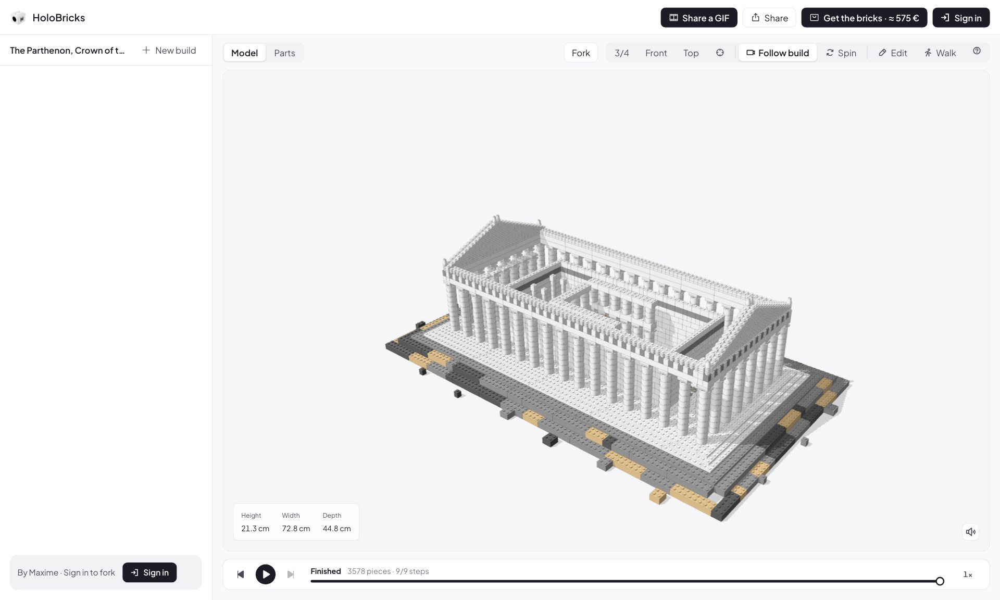
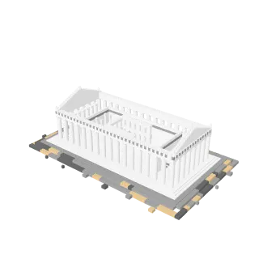
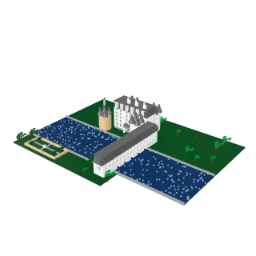
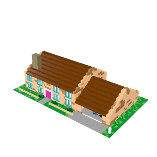

<h1 align="center">
  
  HoloBricks
</h1>

<p align="center"><b>Tell Holo what you'd like to build, watch it come together brick by brick, then order the real parts and build it yourself.</b></p>



<table align="center">
  <tr>
    <td align="center"><a href="https://bricks.hcompany.ai/?public=c98043c8-6f9d-403a-98d0-4b998d543d81"></a><br />The Parthenon · 3,578</td>
    <td align="center"><a href="https://bricks.hcompany.ai/?public=fa3ab409-798d-42d5-84f0-37dc1056f025"></a><br />Temple of the Great Jaguar · 3,501</td>
    <td align="center"><a href="https://bricks.hcompany.ai/?public=9716814d-cf3c-4d20-8886-5ee345d91f61"></a><br />Château de Chenonceau · 2,775</td>
    <td align="center"><a href="https://bricks.hcompany.ai/?public=babd4b24-2655-4fcf-b57a-aa46087d8f5b"></a><br />742 Evergreen Terrace · 2,187</td>
  </tr>
</table>

## What you can do

|                       |                                                                                                                 |
| --------------------- | --------------------------------------------------------------------------------------------------------------- |
| **Describe**          | Type an idea or drop in a photo, and Holo builds it in 3D while you watch.                                      |
| **Trust**             | Every brick is a real LDraw part, checked to make sure it fits and connects.                                    |
| **Replay**            | Scrub back through the steps, or share the build as a GIF.                                                      |
| **Tweak**             | Move, turn, recolor and replace pieces, or walk through the model.                                              |
| **Build it for real** | Get the instructions as a PDF, an official parts store list, or BrickLink carts through [HoloTab](SHOPPING.md). |
| **Share**             | Publish a build so anyone can open it, and builders can remix it into their own.                                |

## How it works

```
 you ── idea ──▶  Holo  (H Agents API)  ── bricks run ──▶  Workstation
  ▲                 │                                         │
  └── 3D model ◀────┴─────────────── model.json.gz ◀──────────┘
```

Your browser renders every revision and shows it to Holo, so keep the tab open while it builds.

Every build above was made by Holo from a sentence. Live at [bricks.hcompany.ai](https://bricks.hcompany.ai): browse the public builds without an account, sign in with Google or an email to build.

## Run it yourself

You need Node 24, Python with [uv](https://docs.astral.sh/uv/), a free [Rebrickable](https://rebrickable.com/api/) API key, a [Vercel Blob](https://vercel.com/docs/vercel-blob) store, and an H account from [platform.hcompany.ai](https://platform.hcompany.ai): signing in mints the Agents API key Holo builds with.

```bash
git clone https://github.com/hcompai/brickyard && cd brickyard
scripts/fetch-ldraw.sh                                # the LDraw parts library (145 MB)
(cd server && uv sync && REBRICKABLE_API_KEY=... .venv/bin/brickyard-catalog)   # the parts catalog
server/.venv/bin/python scripts/pack-toolkit.py       # the toolkit the app sends Holo
cd web && npm install
printf 'BRICKYARD_SECRET=%s\nBLOB_READ_WRITE_TOKEN=...\n' "$(openssl rand -hex 32)" > .env.local
npm run dev
```

Open http://127.0.0.1:5173 and sign in with your H account. `sh setup.sh` installs the toolkit's `bricks` command on your own machine, as Holo does on its workstation.
