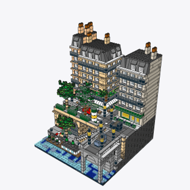
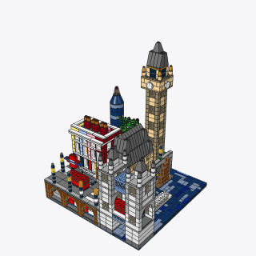
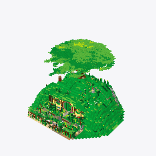
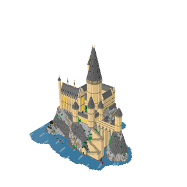

<h1 align="center">
  
  HoloBricks
</h1>

<p align="center"><b>Tell Holo what you'd like to build, watch it come together brick by brick, then order the real parts and build it yourself.</b></p>


<table align="center">
  <tr>
    <td align="center"><br />Paris · 2,135</td>
    <td align="center"><br />London · 1,534</td>
    <td align="center"><br />Bag End · 7,329</td>
    <td align="center"><br />Hogwarts · 45,073</td>
  </tr>
</table>

## What you can do

| | |
| --- | --- |
| **Describe** | Type an idea or drop in a photo, and Holo builds it in 3D while you watch. |
| **Trust** | Every brick is a real LDraw part, checked to make sure it fits and connects. |
| **Replay** | Scrub back through the steps, or share the build as a GIF. |
| **Tweak** | Move, turn, recolor and replace pieces, or walk through the model. |
| **Build it for real** | Get the instructions as a PDF, a Pick a Brick list, or BrickLink carts through [HoloTab](SHOPPING.md). |
| **Share** | Publish a build so your teammates can open it and remix it into their own. |

## How it works

```
 you ── idea ──▶  Holo  (H Agents API)  ── bricks run ──▶  Workstation
  ▲                 │                                         │
  └── 3D model ◀────┴─────────────── model.json.gz ◀──────────┘
```

Your browser renders every revision and shows it to Holo, so keep the tab open while it builds.

## Run it

Anyone at H Company can sign in with their `@hcompany.ai` account. Setup, deploy, tests and the toolkit's checks are in [docs/README.md](docs/README.md).
