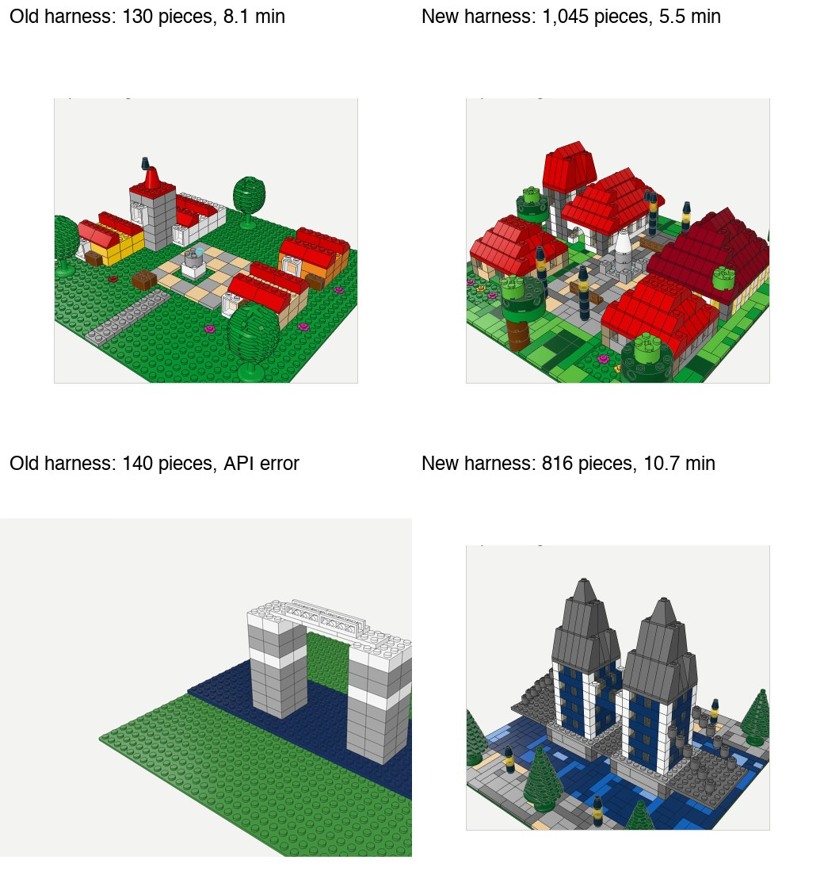

# Brickyard

Watch an agent build Lego models from real LDraw parts, step by step, in the browser.

Gallery (H team, Vercel login): https://brickyard-h-company.vercel.app


Holo's lighthouse (138 pieces, 23 steps, 8 min), as Holo itself sees it through `look`:


Shape tools (`walls`, `fill`, `roof`) versus brick-by-brick only, same Holo, same prompts ("A cozy village square with a church, a few houses, a fountain and trees"; "Tower Bridge in London over the Thames"):



Showcase dioramas, hand-scripted by Claude through the same validated workbench (`python -m brickyard.showcase paris|hogwarts|london`):

| Paris, the Seine at Saint-Germain (32x32, 2,169 pieces) | Hogwarts (64x64, 5,294 pieces) | London in layers (32x32, 1,555 pieces) |
| --- | --- | --- |
|  |  |  |

```
web (Vite + React + three.js)                         server (FastAPI)
┌ header: name · pieces · steps · Download ┐         ┌ Session: build = pieces + steps + chat, saved to data/
│ Chat | Library  │ Model | Parts          │◀─ SSE ──┤ Builders: holo (agent loop), showcases, demo
│                 │ three.js LDrawLoader   │         │ Workbench: tools + validation (overlaps, floating)
│                 │ timeline ▶ 1× 2× 4×    │─ fetch ▶│ /api/parts/<part> → one packed MPD, colored in the viewer
└─────────────────┴────────────────────────┘         └ /api/builds/<id>/download.ldr with STEP lines
```

## Run

```bash
scripts/fetch-ldraw.sh                              # 145 MB official parts library into ./ldraw
cd server && uv sync && cd ..
cd web && npm install && npm run build && cd ..
server/.venv/bin/brickyard                          # http://127.0.0.1:8000
```

Frontend hot reload: `cd web && npm run dev` (http://127.0.0.1:5173, proxies `/api` to the server).

## Gallery

A read-only, static export of chosen builds (models, step replay, parts list, Holo's chat and renders), deployed to
Vercel under the H Company team and visible to team members only:

```bash
scripts/deploy-gallery.sh             # production
scripts/deploy-gallery.sh --preview   # preview URL
```

It builds the site with `npm run build:gallery`, exports the builds listed in the script with
`brickyard-gallery <site> <id>...` (parts are packed from the local LDraw library), and ships the output with
`vercel deploy --prebuilt`. Live building stays in the local app.

## Builders

A builder turns a chat request into steps through a `Session`:

```python
class MyBuilder:
    name = "mine"

    async def run(self, session: Session, request: str) -> None:
        await session.say("Laying the base.")
        await session.step("Base", [place("3811.dat", 0, 0, 0, color=2)])
```

`place(part, x, y, z, color, rotation)` puts any LDraw part on stud `(x, y)` at plate height `z`; footprints and
heights come from the part geometry, so all ~25k parts work without a catalog. Register builders in
`server/brickyard/builders/__init__.py`.

| Builder | What it does |
| --- | --- |
| `holo` | Holo (`holo4-27b`) in a tool loop: shape tools `walls` (bonded, hollow, windows, arched doors), `fill` (plates, tiles, textured mosaics that pave around what is built) and `roof` (hipped, 45° or steep), plus `add_bricks`, `remove_bricks`, `look`, `find_parts`, `find_reference`, `list_pieces`, `set_name`. Everything is validated (bounds, overlaps, floating); `look` returns a 4-view render from the open viewer. Reasoning streams live into the chat. |
| `demo` | Scripted cottage, no model needed. |
| `claude` | Showcase builds from `server/brickyard/showcase`; asking to change one hands it to Holo. |

Holo needs a key: `HOLO_API_KEY=... server/.venv/bin/brickyard` (`HAI_API_KEY` also works). Optional: `HOLO_MODEL`,
`HOLO_BASE_URL`.

## Tests

```bash
cd server && uv run pytest -q && uv run ruff check .
cd web && npm run typecheck
```
