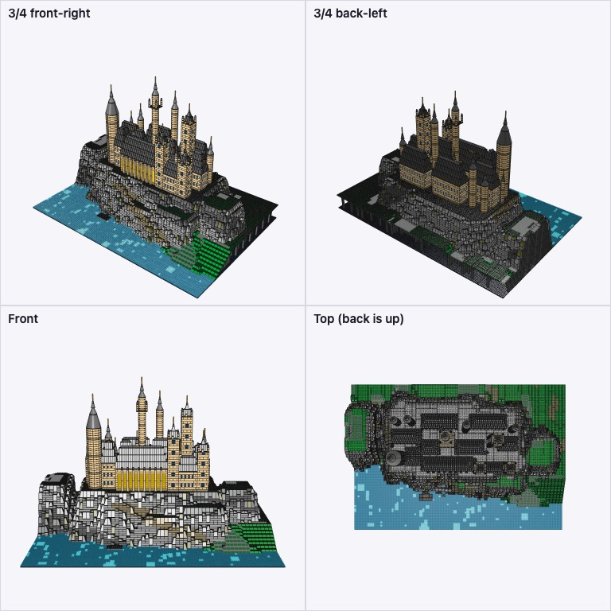
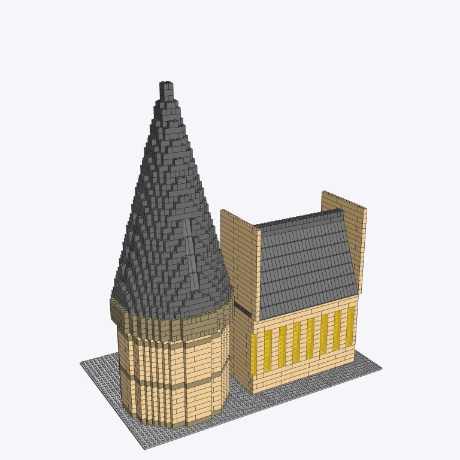
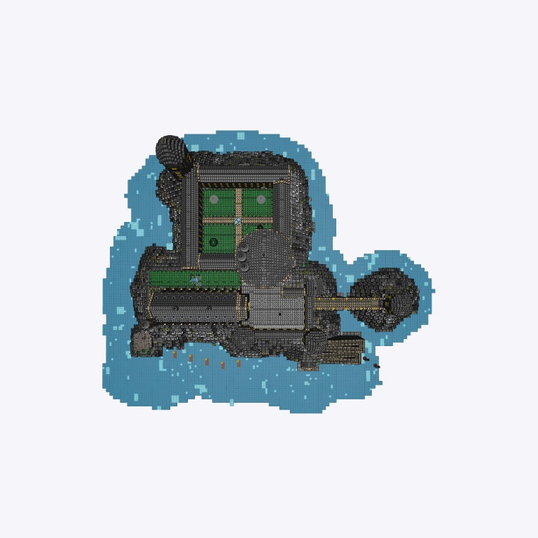
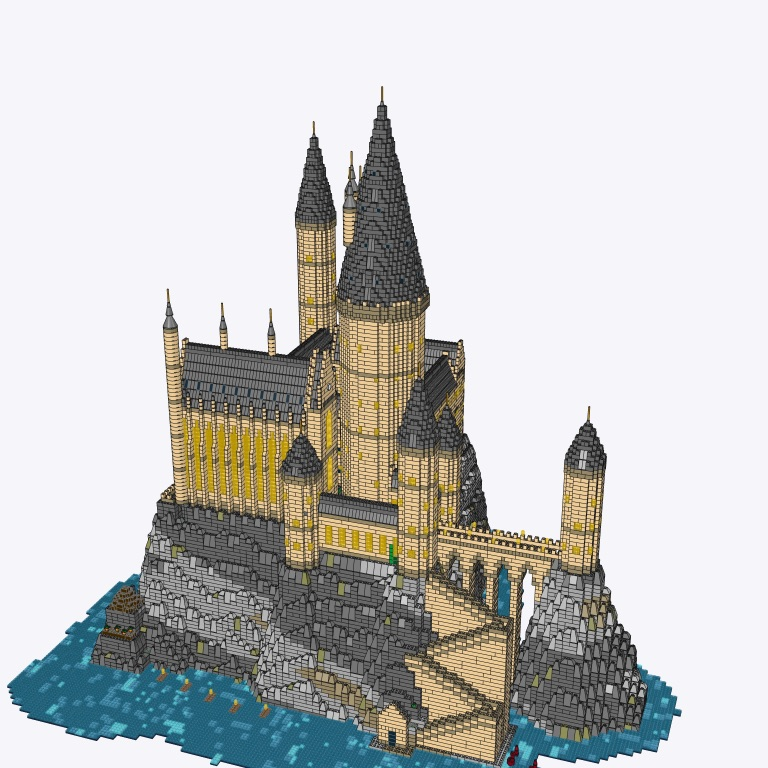
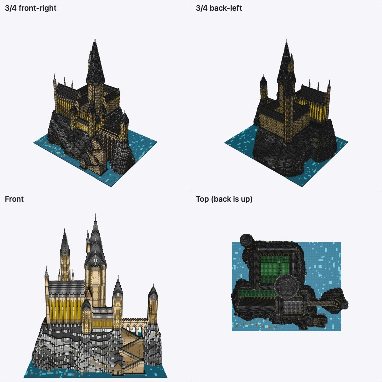
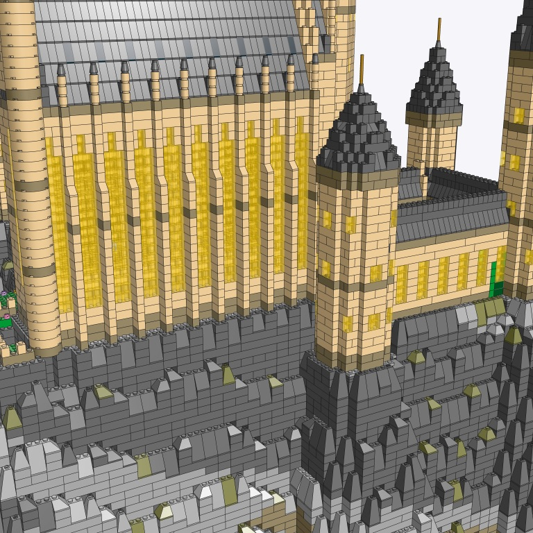
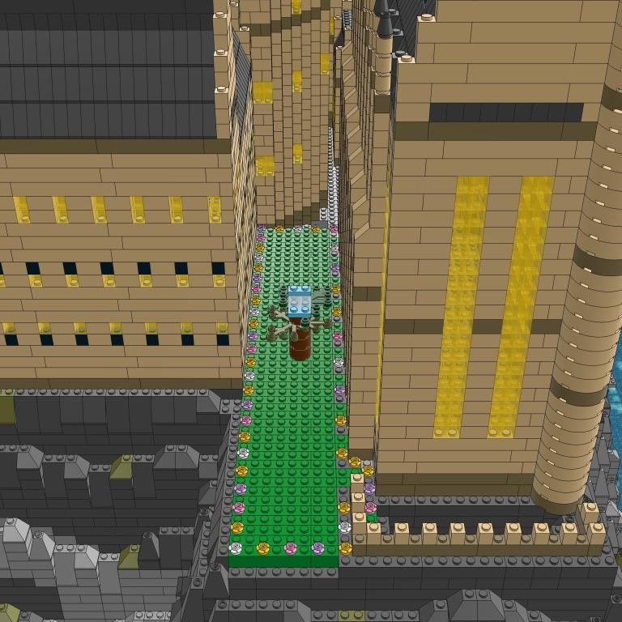

# How Claude rebuilt Hogwarts

A log of the process, tools and decisions, to distill into Holo's harness.

## 0. Brief

> Rebuild Hogwarts from scratch. Ugly, didn't look like Hogwarts. Big, not square, real height. Fetch references, plan.

## 1. Look at what exists before touching it

| Step | Tool | Why |
|---|---|---|
| Read `showcase/hogwarts.py`, `kit.py`, `shapes.py` | file read | know the helpers and the old design |
| Render the old build | `GET /api/builds/hogwarts/sheet.png` (4 views) | judge it with eyes, not code |
| Read the checker (`workbench._check`, `model.place/bounds`) | file read | learn the rules: bounding boxes collide, "floating" is only a warning, mounted parts skip the support check |
| Query the part library by id and keyword | `ldraw.search`, `part_line` | know real sizes (a 3942c cone is 2x2x6 plates, a 4460b slope is 1x2x9) before designing |
| Check the viewer scales | grep `InstancedMesh` in `scene.ts` | instancing, so 20k+ pieces are fine |

Diagnosis of the old build (`data/refs/hogwarts/v0-old-sheet.png`):

- cliff is 8 courses on a 64x64 square: no drama, no height
- walls grey, roofs flat bright blue: Hogwarts is **tan walls, dark grey spires**
- lake is a noisy speckle of three blues
- castle reads as boxes with small cones; no spiky silhouette, no cascade down the rock
- cliff face is striped 1-course brick rows, not rock

## 2. References

| Ref | Source | What it teaches |
|---|---|---|
| LEGO 76419 Castle and Grounds (microscale) | brickset.com image | tan walls, dark grey cone roofs, **jagged grey cliff of big angled facets**, bright trans-blue water, stairs down the rock, boathouse |
| LEGO 71043 Hogwarts Castle (microscale) | brickset.com image | Great Hall with buttresses and a long steep roof, Astronomy Tower tallest with a clustered crown, viaduct arches, covered bridge |
| Studio Tour model, 2 views | Wikimedia Commons API search | real composition from the lake: big round tower left, viaduct front-left, Great Hall front-center, Astronomy Tower center-back, Gryffindor square tower with spires right, greenhouses front-right |

Tools: `curl` on predictable brickset URLs (`images.brickset.com/sets/images/<set>-1.jpg`), Wikimedia Commons `api.php?generator=search&prop=imageinfo&iiurlwidth=900` for licensed photos, then read each image to look at it. Saved to `data/refs/hogwarts/`.

Lesson: **official LEGO sets of the same subject are the best reference**; they already solved "how does this look in bricks at this scale".

## 3. Plan

Build area **128 x 88** (lake in front and on the left, forest behind on the right). Castle crest near 220 plates: height about 0.7x the width.

Palette: tan (19) walls, dark tan (28) plinths and trims, dark bluish grey (72) roofs and spires, pearl gold (297) finials, light and dark bluish grey (71, 72) rock with olive (330) and dark green (288) tufts, trans-light-blue and trans-dark-blue water over blue.

Layers, each its own steps:

1. **Lake**: blue base, calm trans-blue plates, few highlights.
2. **Cliff**: a voxel heightmap, meshed into bricks: exposed faces only (hollow inside), faces bevelled with 45/65/75 degree slopes so they read as angled crags, not brick rows.
3. **Castle**, reusable parts: `hall` (buttresses, lancets, steep roof), `round_tower` (2x2, 3x3, 4x4, cone spire with a gold finial), `square_tower` (corner pinnacles, pyramid spire), `curtain` (crenellated walls).
   - Great Hall, Astronomy Tower (tallest, crown of spires), the big round tower, Gryffindor/clock tower, Headmaster's tower, viaduct arches, covered bridge, greenhouses.
4. **Below and around**: boathouse at the water with stairs up the rock, boats, Hagrid's hut, Forbidden Forest.

Loop: script, run, render 4 views, then close-up looks at weak spots, fix, repeat. Compare each render against the references side by side.

## 4. Build log

### 4.1 Tooling first

- **Camera renders from the terminal.** `GET /api/builds/<id>/sheet.png` renders in headless Chrome. I gave it `?angle=&elevation=&zoom=&at=x,y,z` so any close-up is one `curl` (5 to 8 s). Wrapper: `r.sh BUILD OUT.png [angle elev zoom at]`.
- **Part rotations.** One render of each unknown part in four rotations gave:
  - `48092` 4x4 corner round: rot 90 = front-left quarter, 0 = front-right, 180 = back-left, 270 = back-right; four make an 8x8 round tower. `5152` 3x3 the same, for 6x6.
  - `48310` half cone 8x4x6: rot 0 is the front half, rot 180 the back; together an 8x8 cone with a 4x4 top.
  - a 1x1 finial on a 2x2 cone sits between grid cells, so I added `Kit.centered` (half-stud offset, placed as a mounted part).

### 4.2 Terrain, three tries

- v1: heightmap on 1-stud cells. Noisy, boxy, floating bricks.
- v2: 2x2-stud super-cells, hidden columns placed first, 2-wide aligned runs so each face brick touches its column.
- v3: edges bevelled with 2x2 slopes sized by the drop (1/2/3 courses). Crag facets, strata, olive moss. 6.5k pieces, 0 problems.
- Lesson: **coarser cells + slopes read as rock**; 1-stud noise reads as pixels.

### 4.3 Castle v1: rejected

10.7k pieces, 0 problems, and still wrong. User: "super off regarding the architecture", "no thin ass towers/walls".

Why it failed:
- I invented a layout from memory instead of reading plans.
- Everything tiny (4x4 towers) so nothing reads from afar.
- Castle sat back from the cliff edge; the plateau dwarfed it.

### 4.4 Real plans, then a new scope

| Ref | Source | What it taught |
|---|---|---|
| Stuart Craig's concept sketch | hogwarts4d.home.blog | the canonical left part: Great Hall on the cliff edge, Marble Staircase Tower behind its right end, pepperpot in front, viaduct right, boathouse below |
| Hogwarts 4D model (fan rebuild of the film miniature) | same blog, block-in and detail renders | proportions: tower 92 ft wide, spire ~2x its width, top 600 ft above the lake; hall ~1.5x the tower's width long |
| Harry Potter wiki | fandom | the big cone tower is the **Marble Staircase Tower** (Turris Magnus), with 3 small turrets on its cone |
| LEGO 71043 | brickset | the same left part in bricks: tan walls, dark grey stepped cone, buttress pinnacles above the roof |

Tools: web search for names and plans, `curl` the blog posts, `rg` the image URLs out of the HTML, `curl ?w=1000` for sized copies, read each image.

Decision (agreed with the user): **build only the left part, at ~3x the scale**. Tower 24 studs across, hall 41x14, ~145 courses tall (portrait, like the film shot).

Lesson: **name the buildings first** (search "which tower is in shot X"); a name unlocks plans, proportions and fan reconstructions.

### 4.5 A voxel sculptor (`server/brickyard/sculpt.py`)

Big round towers and cones don't exist as parts, and hand-placing bricks can't union buildings. So:

- Buildings are solids on a stud x course grid: `fill`, `roof` (hip or gable by erosion), `cone`, `part` (a real part claims its voxels).
- `mesh` emits only the shell: studs next to air (2 deep on sloped solids), or open on top.
- Steady steps become slopes: 45/65/75 degrees picked from the rise of the step above.
- A hanging stud gets a 2 to 4 stud bridge to a held one where one fits, most constrained studs first.

Test: a 24-stud tower + cone next to a gabled hall, 3.3k pieces in 0.1 s, 4 floaters left (fixing).

Lesson: **when parts can't express the shape, build a small geometry layer** and let it guarantee the rules (no overlap) by construction.

### 4.6 A bug that lied to me: stale renders

A render looked unchanged after a real change. Cause: the user's open browser tab also answers render requests, and it still showed the old model.

- Fix: every render request carries the piece count; a viewer answers only if its model matches. Viewers resync when the build changes on disk.
- Lesson: **when a render disagrees with the code, suspect the renderer first**. Check the piece count before believing a picture.

### 4.7 Terrain under the castle

- Rock pillars grew under the corbelled crowns: pads counted overhanging courses. Now only courses up to the plateau make pads.
- The viaduct deck flattened the ravine. Now only its pier feet make pads, and a wider span lets the piers stand in water.
- Lesson: **derive the terrain from the buildings**, but only from the parts that touch the ground.

### 4.8 Details that make it read as Hogwarts

| Change | Why |
|---|---|
| Hall lancets 3 wide, pointed, not cut by the band | the film's tall lit windows |
| Dumbledore's turrets hug the cone | they looked like separate towers |
| Quad as gabled wings plus a square tower | it read as one big box from the back |
| 6 boats with lanterns on the lake | the arrival shot |
| darker rock palette | the cliff read as concrete |

Result: 26.3k pieces, 41 steps, 0 problems.

Lesson: **compare against the reference shot from the same camera** (`r.sh hogwarts out.png 335 4 1.3`); a generic view hides what's off.

### 4.9 Layout from a floor plan

User: "way off in terms of structure... missing the entire courtyard in front of the Great Hall". I had polished details on a wrong plan.

The user sent 3 fan floor plans of the film castle. What they showed:

| Plan | My build |
|---|---|
| Viaduct Courtyard: open yard at the tower's foot, right of the Hall | a solid block |
| Entrance Hall: a narrow wing from the tower to the lake front | a 16x16 block |
| South Courtyard: a 52-stud ring behind the tower, Gryffindor Tower opposite | a small box |
| viaduct leaves from the courtyard | leaves from a wing |
| switchback stairs from the courtyard down to the boathouse | missing |

How: overlay a labelled grid on the plan, read corner pixels, rotate so the camera looks from the lake, scale by the tower (24 studs across). Then every building is placed relative to the tower's center.

- Kept on the grid: the plan's diagonal viaduct and the 42 degree South Courtyard. Diagonal walls read as jagged bricks.
- Terrain fix found on the way: a 2x2 terrain cell now meets the **highest** foot in it, so no building hovers a course above a lower lawn.

Result: 33.6k pieces, 41 steps, 0 problems.

Lesson: **get the plan right before any detail**. Find a floor plan first, and check the render's top view against it at every step.

### 4.10 Life, easter eggs, and the Hall's front

User: "make it lively, go into details, maybe some easter eggs". Then: "in front of the Great Hall there's another building that makes no sense", with a film still and a LEGO Great Hall: "should look like this".

| Added | Where |
|---|---|
| lawns with paths, fountain, 4 trees, flower borders | South Courtyard |
| 2 trees, 4 lamps, gold statue, paving | Viaduct Courtyard |
| ivy on the lower walls, lanterns on the viaduct | walls |
| pines on flat crags, denser for the Forbidden Forest | cliffs |
| Hagrid's hut, pumpkin patch | left edge |
| Whomping Willow holding the Ford Anglia | lawn behind the Hall |
| giant squid tentacles, Trevor the toad | Black Lake |
| gabled front: crow-stepped gable, clock, stacked lancets, pinnacles, pointed door | Great Hall, facing the courtyard |
| roof dormers, spires on the corners | Great Hall roof |

- The stray building was my Entrance Hall wing, placed from a plan without checking how the film shows it. I removed it.
- Decor goes in its own steps, after the sculptor. It uses `kit.add` on real surfaces (lawn cells owned by the grounds, the top of a ground column), so the checker catches anything that floats.
- Bugs found in renders, not in code: flowers on green ivy walls (filter by owner too), a toad inside a rock column, squid tentacles that looked like pipes (now a thick base that tapers and curls).

Result: 34.4k pieces, 46 steps, 0 problems.

Lesson: **when the user sends a reference image, copy it feature by feature**, then render from the same angle. A plan tells you where things are; a photo tells you what they look like.

### 4.11 An organic lake, and holes beside the slopes

User: "instead of a rectangular water, make the water surround the rocky cliff in an organic way". Then: "some pieces are diagonal, and they reveal underlying holes".

| Before | After |
|---|---|
| the lake filled the 152x124 rectangle; the crag was cut off at 3 of its edges | the terrain runs past the plan's frame, so the crag's foot ends naturally; the lake is a band 4 to 23 studs wide around it (wider in front, where the boats cross), and nothing lies beyond: 188x160 |
| a rock cell next to a bevel counted the bevel's cell as solid up to its top | a bevel's cell counts as solid only on its back side (a corner bevel on none), so the rock beside and behind it builds its face |

- The castle keeps its plan coordinates; the kit moves every brick by one offset when it commits a step, so nothing in the plan changed.
- The lake reaches out from the rock by distance plus two layers of noise, and any bay it encloses fills with water.
- Holes of this kind show only in close views from the side: the four standard views never caught them.

Result: 36.7k pieces, 46 steps, 0 problems.

Lesson: **a hollow shell is only as tight as its idea of "solid"**. Any part that does not fill its cell (a slope, a round, a corner) must say which of its sides it closes.
